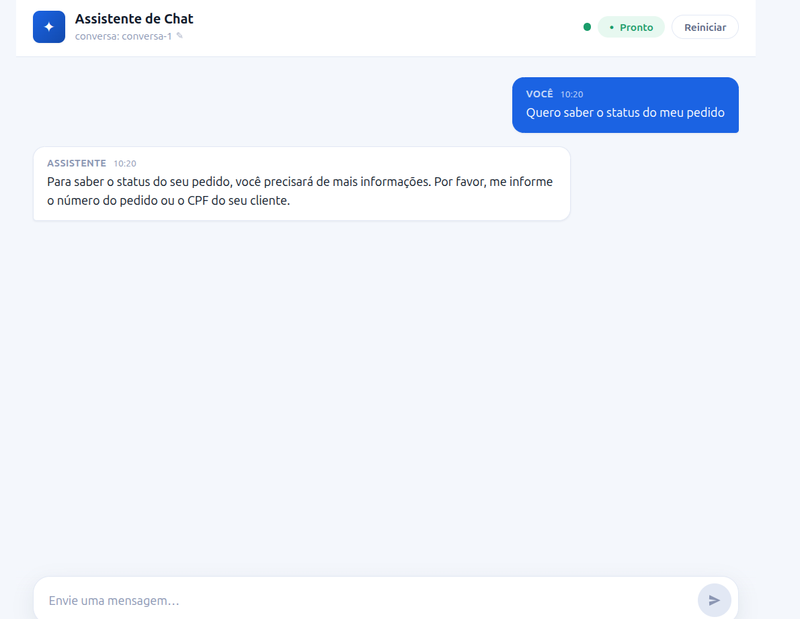
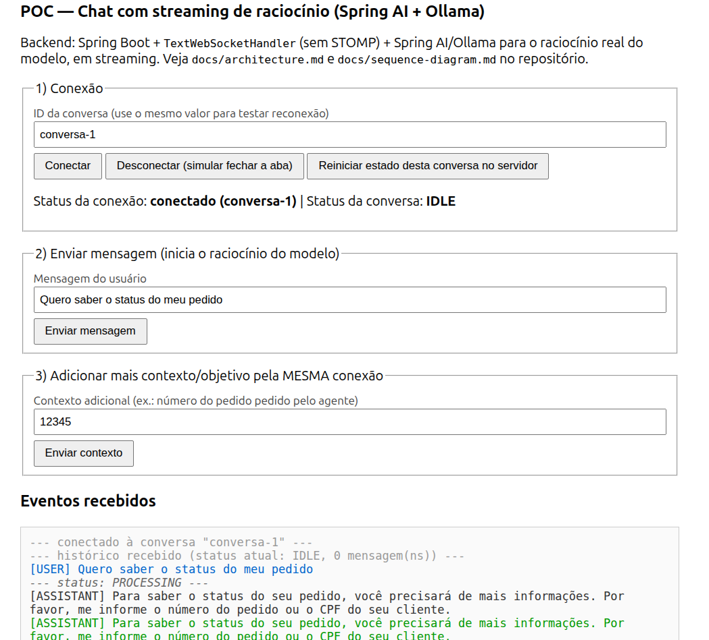
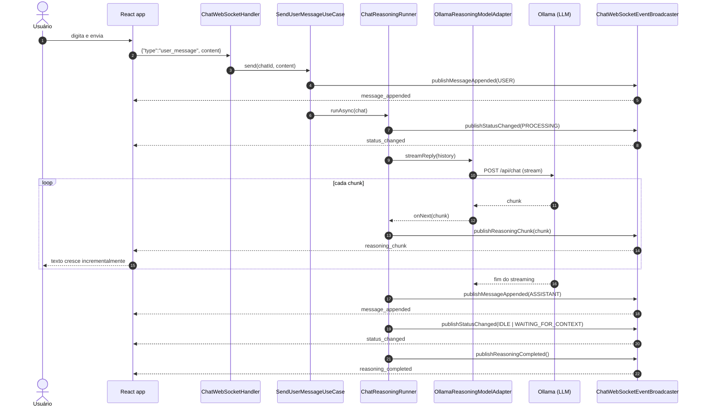
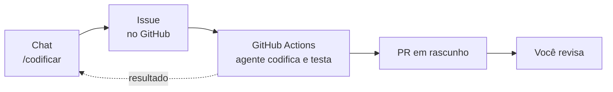

# WebSocket Chat Demo — Streaming de LLM com Spring AI + Ollama

Chat com streaming real de respostas de um LLM local (Ollama), sobre
WebSocket "cru" (sem STOMP), com uma UI em React que se comporta como os
harnesses de produção do mercado: dá para **parar a geração** a qualquer
momento e **mandar uma nova mensagem enquanto o modelo ainda responde**
(ela interrompe e substitui a rodada atual — como no ChatGPT e no Claude).

Backend em **Java 21 + Spring Boot + Spring AI**, seguindo **Clean
Architecture / Ports & Adapters**; frontend em **React 18 + TypeScript +
Vite**.




## Índice

- [Objetivo do projeto](#objetivo-do-projeto)
- [Funcionalidades](#funcionalidades)
- [Como funciona (diagrama de sequência)](#como-funciona-diagrama-de-sequência)
- [Agente de codificação: do chat ao pull request](#agente-de-codificação-do-chat-ao-pull-request)
- [Tecnologias e técnicas utilizadas](#tecnologias-e-técnicas-utilizadas)
- [Arquitetura em um relance](#arquitetura-em-um-relance)
- [Como rodar](#como-rodar)
- [Roteiro de teste sugerido](#roteiro-de-teste-sugerido)
- [Testes automatizados](#testes-automatizados)
- [Estrutura do projeto](#estrutura-do-projeto)
- [Limitações propositais](#limitações-propositais)
- [Documentação completa](#documentação-completa)

## Objetivo do projeto

Este projeto existe para demonstrar, de ponta a ponta, como estruturar **um
chat com streaming real de LLM sobre WebSocket** seguindo boas práticas de
mercado — não é um brinquedo com respostas simuladas, é um caso de uso
completo: conexão, streaming token a token, interrupção, substituição de
rodada, contexto adicional, reconexão sem polling, tudo com testes
automatizados (unitários e de integração) e uma UI de verdade.

É também material de estudo: a arquitetura é deliberadamente explícita
(Ports & Adapters, um caso de uso por classe) e a documentação em
[`docs/`](docs/) explica o "porquê" de cada decisão — veja especialmente o
guia didático de WebSocket em
[`docs/websocket-explained.md`](docs/websocket-explained.md).

O projeto também documenta sua própria evolução: começou como um cliente
HTML/JS puro (sem framework) só para validar o protocolo WebSocket, e
depois virou a interface React do topo deste README.

<details>
<summary>Ver a versão inicial (HTML/JS puro, sem framework)</summary>


</details>

## Funcionalidades

1. **Streaming real de LLM**: a resposta chega **token a token**
   (`reasoning_chunk`), não de uma vez.
2. **Parar a geração** — como o botão "stop" do ChatGPT/Claude: o trecho já
   gerado é preservado no histórico, marcado como interrompido.
3. **Mandar uma nova mensagem enquanto o modelo ainda responde**: interrompe
   a rodada atual (preservando o parcial) e já inicia a próxima — sem
   precisar clicar em "parar" antes.
4. **Pedido de mais contexto**: se o modelo precisar de um dado específico
   (ex.: número de um pedido), o status muda para `WAITING_FOR_CONTEXT`;
   você responde pela mesma conexão e o processamento retoma sozinho.
5. **Reconexão sem polling**: feche a conexão e reconecte com o mesmo ID de
   conversa — o servidor devolve o histórico completo e o status atual,
   incluindo o que foi processado enquanto você estava offline.
6. **Reset**: zera o histórico e o status da conversa no servidor.
7. **Agente de codificação**: `/codificar <o que implementar>` abre uma issue no GitHub
   com o pedido e o contexto da conversa, dispara um agente no GitHub Actions e devolve
   no chat o link do pull request em rascunho, os arquivos alterados e o resultado dos testes.

## Como funciona (diagrama de sequência)

Fluxo principal — enviar uma mensagem e receber a resposta em streaming:



Esse é 1 dos 6 fluxos documentados. Os outros 5 — **conectar/reconectar**,
**parar a geração**, **substituir a rodada em andamento**, **contexto
adicional** e **reset** — estão, cada um em seu próprio diagrama, em
[`docs/sequence-diagram.md`](docs/sequence-diagram.md).

## Agente de codificação: do chat ao pull request

O chat também funciona como **gatilho** de um agente de codificação. Escreva no chat:

```
/codificar Criar endpoint GET /api/health que responde {"status":"UP"}
- [ ] responde HTTP 200
- [ ] tem teste unitário
```

e o assistente:

1. abre uma **issue** no GitHub com o seu pedido e as últimas mensagens da conversa;
2. dispara o workflow **coding-agent** no GitHub Actions, que roda o agente
   ([`CaioMC/coding-agent`](https://github.com/CaioMC/coding-agent)) num container isolado;
3. acompanha a execução e, quando termina, avisa no chat com o **link do PR em rascunho**,
   os arquivos alterados e o resultado da verificação.



O assistente nunca faz push: ele só abre a issue e dispara o workflow. Quem escreve no
repositório é o workflow, com um token que vale só para aquela execução. O guia completo,
com diagramas, segurança e configuração passo a passo, está em
[`docs/coding-agent.md`](docs/coding-agent.md).

## Tecnologias e técnicas utilizadas

| Camada | Tecnologias | Técnicas |
|---|---|---|
| Backend | Java 21, Spring Boot 3, Spring WebSocket, Spring AI + Ollama, Project Reactor (`Flux`) | Clean Architecture / Ports & Adapters, streaming reativo, testes com JUnit 5 + Mockito + Awaitility |
| Frontend | React 18, TypeScript, Vite | Hooks para separar transporte (`useChatSocket`) de estado (`useChat`), estado 100% derivado dos eventos do servidor (sem UI otimista) |
| Testes | JUnit 5, Mockito, AssertJ, Awaitility, Spring Boot Test | Unitários com portas mockadas + integração ponta a ponta via WebSocket real (`maven-failsafe-plugin`) |

O porquê de cada dependência específica (e não outra) está detalhado em
[`docs/dependencies.md`](docs/dependencies.md).

## Arquitetura em um relance

```
adapters (WebSocket, Ollama, persistência em memória)
   ↓ depende de
core.usecase (interfaces — um caso de uso por classe)
   ↓ implementado por
core.application (services + ChatReasoningRunner)
   ↓ opera sobre
core.domain (Chat, ChatMessage, ChatStatus... zero deps de infraestrutura)
```

O `core` nunca importa `adapters` — é o que permite trocar Ollama por outro
provedor de LLM, ou memória por um banco de verdade, sem tocar em uma linha
de regra de negócio. Detalhes completos, incluindo as portas e por que cada
uma existe, em [`docs/architecture.md`](docs/architecture.md).

## Como rodar

### Pré-requisito: Ollama rodando localmente

```bash
docker run -d --name ollama-demo -p 11434:11434 ollama/ollama:latest
docker exec ollama-demo ollama pull qwen2.5:0.5b   # modelo leve, bom para testes locais
```

Qualquer modelo de chat suportado pelo Ollama funciona — ajuste
`OLLAMA_CHAT_MODEL` conforme o modelo escolhido. Modelos maiores seguem
melhor a heurística de "preciso de mais contexto" (ver
[`docs/architecture.md`](docs/architecture.md#4-spring-ai--ollama)).

### Build + start

```bash
# 1) build da UI React (gera os assets em target/classes/static,
#    de onde o Spring Boot os serve)
cd frontend && npm install && npm run build && cd ..

# 2) sobe o backend
mvn spring-boot:run
```

Abra **http://localhost:3000**.

> Só precisa repetir o `npm run build` quando alterar algo em
> `frontend/src`. Para desenvolver a UI com hot reload contra o backend
> real: suba o backend normalmente e, em outro terminal,
> `cd frontend && npm run dev` — abra **http://localhost:5173** (o
> WebSocket é proxyado para o backend em `:3000`).

### Variáveis de ambiente

| Variável | Padrão | Descrição |
|---|---|---|
| `OLLAMA_BASE_URL` | `http://localhost:11434` | URL do servidor Ollama |
| `OLLAMA_CHAT_MODEL` | `qwen2.5:0.5b` | Modelo usado para o chat |
| `WEBSOCKET_ALLOWED_ORIGINS` | `*` | Origens permitidas no handshake WS |
| `CODING_AGENT_GITHUB_TOKEN` | (vazio) | Token fine-grained do GitHub para o `/codificar` (Issues e Actions: read/write) |
| `CODING_AGENT_REPOSITORY` | `CaioMC/poc-websocket-demo` | Repositório onde a issue é aberta e o agente trabalha |
| `CODING_AGENT_BASE_BRANCH` | `main` | Branch base das tarefas do agente |

## Roteiro de teste sugerido

1. Abra a página (ID de conversa padrão: `conversa-1`) e mande uma
   mensagem — acompanhe a resposta chegando em tempo real, pedaço por
   pedaço.
2. Clique em **parar** no meio de uma resposta — o texto gerado até ali
   fica marcado como interrompido no histórico.
3. Mande uma mensagem nova **sem** clicar em parar antes, ainda com o
   modelo respondendo — a rodada atual é interrompida e substituída pela
   nova automaticamente.
4. Peça algo que exija um dado específico (ex.: "quero saber do meu
   pedido") — se o modelo pedir mais informação, o composer avisa; responda
   e o processamento retoma sozinho.
5. Dê um F5 na página no meio de uma resposta — ao reconectar (mesmo ID de
   conversa), o histórico completo reaparece, incluindo o que foi gerado
   enquanto a aba estava fechada.
6. Use **Reiniciar** para zerar a conversa e testar tudo de novo.
7. Com `CODING_AGENT_GITHUB_TOKEN` configurado, mande
   `/codificar Criar endpoint GET /api/health` e acompanhe o cartão da tarefa: issue
   criada, agente trabalhando no GitHub Actions e, no fim, o link do PR em rascunho
   (ver [`docs/coding-agent.md`](docs/coding-agent.md#8-configuração-passo-a-passo)).

## Testes automatizados

```bash
mvn test     # unitários — core com portas mockadas, sem Ollama nem WebSocket real
mvn verify   # unitários + integração (WebSocket real, via maven-failsafe-plugin)
```

Os testes de integração (`ChatWebSocketHandlerIT`) sobem o contexto Spring
completo e conectam de verdade via `StandardWebSocketClient`, mas trocam o
`ReasoningModelPort` real por um fake determinístico — não dependem do
Ollama estar rodando.

## Estrutura do projeto

```
├── pom.xml
├── frontend/                          # UI React — ver docs/architecture.md#7-front-end
└── src/main/
    ├── java/com/example/wschat/
    │   ├── core/chat/                 # regra de negócio — zero deps de infra
    │   │   ├── domain/                # Chat, ChatMessage, ChatStatus, ChatRole, ChatSnapshot
    │   │   ├── usecase/                # um caso de uso por interface
    │   │   └── application/            # implementações + ChatReasoningRunner
    │   ├── core/codingtask/           # gatilho do agente de codificação (issue + workflow)
    │   ├── adapters/chat/             # WebSocket, Ollama, persistência em memória
    │   └── adapters/codingtask/       # GitHub, agendador de acompanhamento, config
    └── resources/
        ├── application.yaml
        └── static/index.html          # fallback simples se a UI React não foi buildada
```

Estrutura completa, com o papel de cada porta e adapter, em
[`docs/architecture.md`](docs/architecture.md#2-estrutura-de-pacotes).

## Limitações propositais

- **Sem STOMP/SockJS**: WebSocket nativo do navegador + `TextWebSocketHandler`
  do Spring — protocolo próprio, minimalista (ver
  [`docs/websocket-explained.md`](docs/websocket-explained.md#2-websocket-cru-vs-stomp)).
- **Sem banco de dados**: estado em memória (`ConcurrentHashMap`) — nada de
  Postgres/Redis para rodar.
- **Sem function calling estruturado**: "preciso de mais contexto" é uma
  heurística de prompt (prefixo de texto), não tool calling do modelo.

O foco é demonstrar, com boas práticas de mercado, como estruturar um chat
com streaming real de LLM sobre WebSocket — não cobrir todo cenário de
produção (autenticação, persistência durável, rate limiting etc.).

## Documentação completa

| Documento | Conteúdo |
|---|---|
| [`docs/architecture.md`](docs/architecture.md) | Arquitetura Ports & Adapters, portas, concorrência, front-end |
| [`docs/sequence-diagram.md`](docs/sequence-diagram.md) | Os 6 fluxos, um diagrama de sequência por fluxo |
| [`docs/websocket-explained.md`](docs/websocket-explained.md) | Guia didático: por que WebSocket, protocolo, streaming, reconexão |
| [`docs/dependencies.md`](docs/dependencies.md) | Cada dependência de backend/frontend e por que foi escolhida |
| [`docs/coding-agent.md`](docs/coding-agent.md) | Agente de codificação: do `/codificar` ao PR, com diagramas e configuração |
