# Agente de codificação: o fluxo completo, chamada por chamada

Este guia acompanha **uma única tarefa** do começo ao fim: do momento em que você digita
`/codificar` no chat até o PR em rascunho aparecer no GitHub e a mensagem final chegar de
volta na conversa. Cada etapa tem um diagrama, o arquivo onde o código está e o que pode
dar errado ali.

O [`coding-agent.md`](coding-agent.md) é a visão geral (a ideia, a segurança e a
configuração). Este aqui é o **mapa detalhado**: leia quando quiser entender *por que* algo
aconteceu ou *onde* algo quebrou.

> **Exemplo usado do começo ao fim**
>
> ```
> /codificar Criar endpoint GET /api/health que responde {"status":"UP"}
> - [ ] responde HTTP 200
> - [ ] tem teste unitário
> ```
>
> Vamos supor que o GitHub criou a **issue 4** e que o assistente gerou o id de tarefa
> **`28e86892`**.

## Índice

0. [Antes de começar: 10 termos que aparecem o tempo todo](#0-antes-de-começar-10-termos-que-aparecem-o-tempo-todo)
1. [O mapa: dois repositórios, três lugares](#1-o-mapa-dois-repositórios-três-lugares)
2. [A viagem inteira em um diagrama](#2-a-viagem-inteira-em-um-diagrama)
3. [Etapa 1: do teclado ao servidor](#3-etapa-1-do-teclado-ao-servidor)
4. [Etapa 2: a criação da issue](#4-etapa-2-a-criação-da-issue)
5. [Etapa 3: o disparo do workflow](#5-etapa-3-o-disparo-do-workflow)
6. [Etapa 4: uma pipeline que chama outra](#6-etapa-4-uma-pipeline-que-chama-outra)
7. [Etapa 5: dentro do job, passo a passo](#7-etapa-5-dentro-do-job-passo-a-passo)
8. [Etapa 6: o laço do agente (pensar, agir, observar)](#8-etapa-6-o-laço-do-agente-pensar-agir-observar)
9. [Etapa 7: o resultado e a publicação do PR](#9-etapa-7-o-resultado-e-a-publicação-do-pr)
10. [Etapa 8: o assistente acompanha a execução](#10-etapa-8-o-assistente-acompanha-a-execução)
11. [Etapa 9: a resposta volta para o chat](#11-etapa-9-a-resposta-volta-para-o-chat)
12. [Quem tem qual credencial](#12-quem-tem-qual-credencial)
13. [Onde cada erro acontece (e como resolver)](#13-onde-cada-erro-acontece-e-como-resolver)
14. [Mapa de arquivos](#14-mapa-de-arquivos)

---

## 0. Antes de começar: 10 termos que aparecem o tempo todo

| Termo | O que é, em uma frase | Aqui no projeto |
|---|---|---|
| **Issue** | Um "chamado" no GitHub, com título e descrição | É a **tarefa** que o agente vai ler |
| **Workflow** | Um arquivo YAML em `.github/workflows/` que descreve uma automação | `coding-agent.yml` (neste repo) e `agent.yml` (no repo do agente) |
| **`workflow_dispatch`** | Um gatilho de workflow que é acionado **sob demanda**: por um botão ou pela API | É assim que o assistente "aperta o botão" do workflow |
| **`workflow_call`** | Um gatilho que faz o workflow poder ser **chamado por outro workflow**, como uma função | O `agent.yml` é chamado pelo `coding-agent.yml` |
| **Workflow reutilizável** | Um workflow com `on: workflow_call`, que fica num repositório e é usado por outros | O `agent.yml` do `CaioMC/coding-agent` |
| **Run (execução)** | Uma execução concreta de um workflow, com id, status e log | Ex.: `actions/runs/36352347712` |
| **Job / step** | Um run tem jobs. Cada job roda numa máquina e tem vários passos (steps) | Um job só, `code`, com cerca de 12 passos |
| **Runner** | A máquina (normalmente descartável) onde o job roda | `ubuntu-latest`, uma VM do GitHub |
| **Artefato** | Um zip de arquivos que o run guarda depois de terminar | `agent-result`, com `result.json`, `changes.patch` e `journal.jsonl` |
| **PAT × `GITHUB_TOKEN`** | O PAT é um token **seu**, que você cria. O `GITHUB_TOKEN` é criado **pelo GitHub** a cada run e expira no fim | O assistente usa o PAT. O workflow usa o `GITHUB_TOKEN` |

---

## 1. O mapa: dois repositórios, três lugares

Tudo acontece em **três lugares**, e o código está em **dois repositórios**:

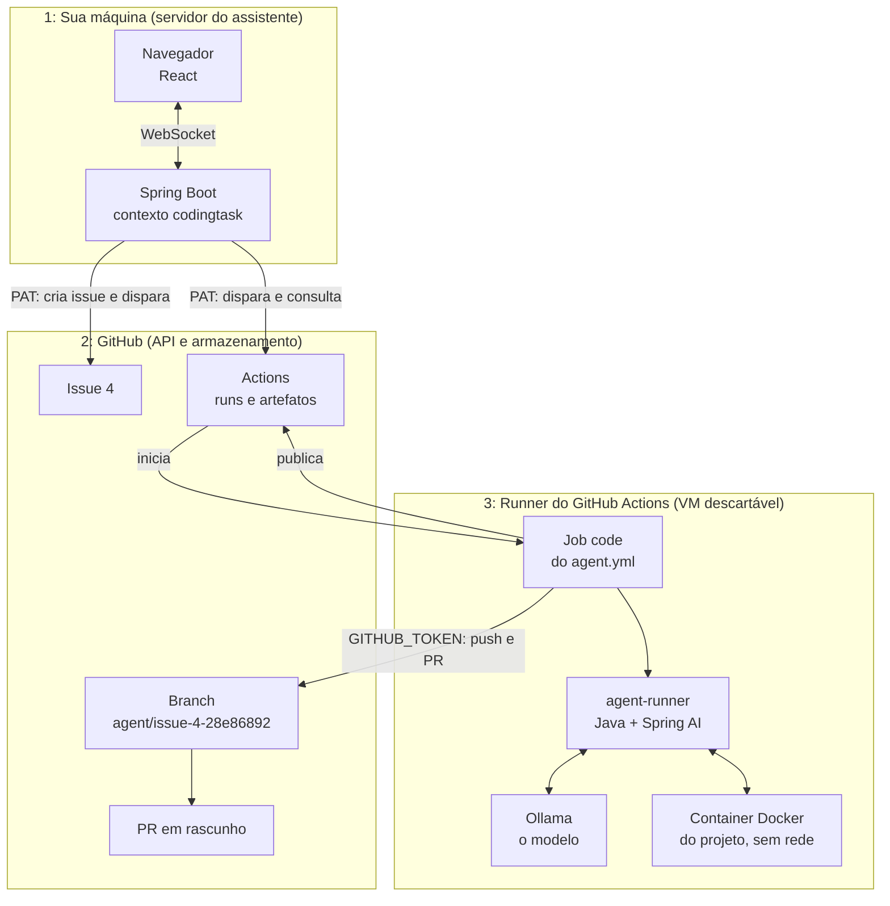

| Repositório | O que tem | Quem é o "dono" do quê |
|---|---|---|
| [`CaioMC/poc-websocket-demo`](https://github.com/CaioMC/poc-websocket-demo) (este) | O chat, o **gatilho** (contexto `codingtask`) e o workflow pequeno `.github/workflows/coding-agent.yml`, que instala o agente | É o **repositório alvo**: onde a issue é aberta e onde o PR vai parar |
| [`CaioMC/coding-agent`](https://github.com/CaioMC/coding-agent) | O workflow reutilizável `agent.yml`, o `agent-runner` (Java) e os scripts `gitops.py`, `setup-ollama.sh` e `prepare-sandbox.sh` | É o **agente**: a lógica fica toda aqui, e qualquer repositório pode usá-la |

A separação existe para você poder instalar o agente em **qualquer** repositório copiando só
um arquivo YAML de 50 linhas. A lógica continua num lugar só.

---

## 2. A viagem inteira em um diagrama

Este é o fluxo completo. As seções seguintes abrem cada bloco.

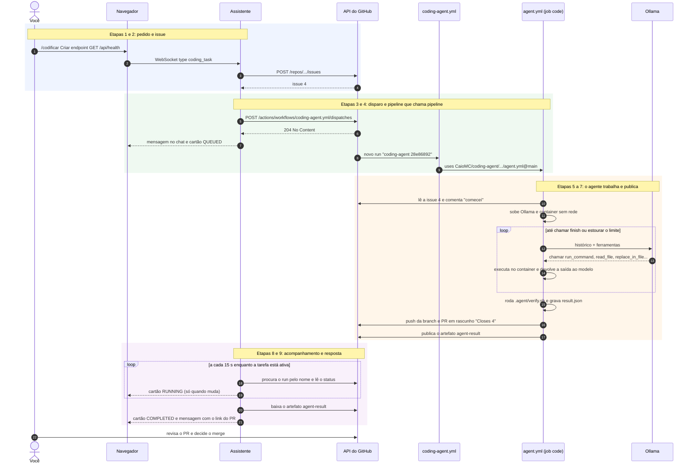

Repare em três coisas:

1. **O assistente nunca fala com o runner.** Toda a comunicação passa pela API do GitHub:
   o assistente escreve (issue, dispatch) e depois **lê** (status, artefato).
2. **O disparo não devolve nada útil.** A API responde `204 No Content`, sem o id do run.
   É por isso que existe o nome `coding-agent 28e86892` (seção 10).
3. **Existem dois workflows** e um chama o outro (seção 6).

---

## 3. Etapa 1: do teclado ao servidor

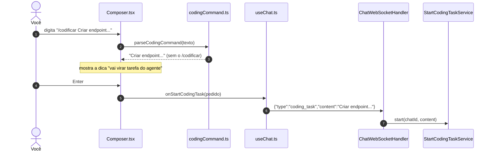

**O que acontece em cada peça:**

| Peça | Arquivo | O que faz |
|---|---|---|
| Reconhecer o comando | `frontend/src/utils/codingCommand.ts` | Se o texto começa com `/codificar ` ou `/codificar` + quebra de linha, devolve o resto. Se não, devolve `null` e a mensagem vai para o LLM do chat, como sempre |
| Decidir o destino | `frontend/src/components/Composer.tsx` | Comando `/codificar` vai para `onStartCodingTask`. Mensagem normal vai para `onSendMessage` |
| Enviar | `frontend/src/hooks/useChat.ts` | Manda o JSON `{"type":"coding_task","content":...}` pelo mesmo WebSocket do chat |
| Receber | `adapters/chat/websocket/ChatWebSocketHandler.java` | O `switch` do `type` direciona `coding_task` para o `StartCodingTaskUseCase` |

> 💡 **O navegador não mostra o `/codificar` sozinho.** Quem coloca o seu pedido no
> histórico é o **servidor** (`CodingTaskChatNotifier.userRequested`). Assim, quem estiver
> conectado na mesma conversa, em outra aba ou depois de reconectar, também vê o pedido.

---

## 4. Etapa 2: a criação da issue

É aqui que a **conversa vira tarefa**. O `StartCodingTaskService.start` faz, nesta ordem:

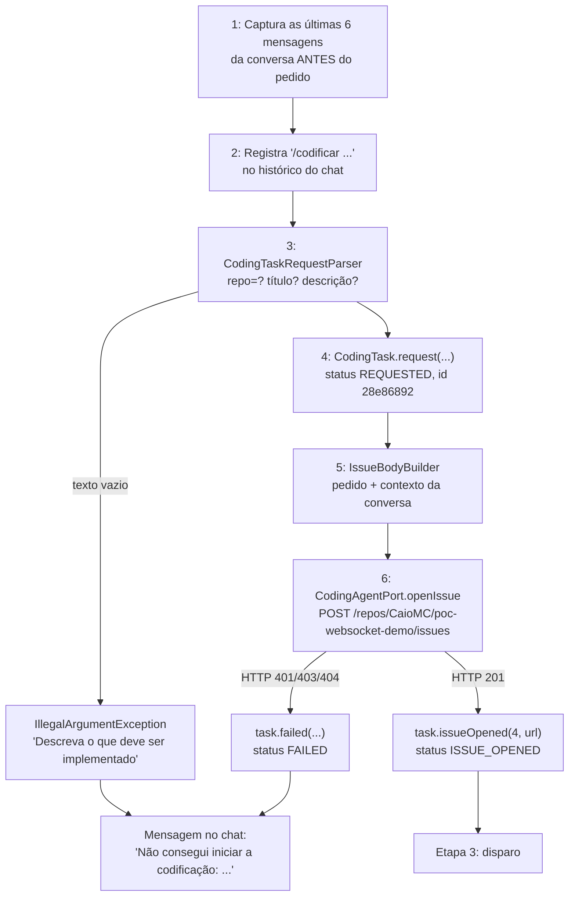

### 4.1 Como o texto é interpretado

`CodingTaskRequestParser` (em `core/codingtask/application`) aplica três regras:

| Regra | Exemplo de entrada | Resultado |
|---|---|---|
| Prefixo `repo=owner/repo` opcional troca o repositório alvo | `repo=CaioMC/outro Corrigir login` | repositório `CaioMC/outro`, texto `Corrigir login` |
| Sem prefixo, usa o padrão | `Criar endpoint...` | `app.coding-agent.repository` (`CaioMC/poc-websocket-demo`) |
| **Primeira linha** vira o título (máximo de 80 caracteres) | `Criar endpoint GET /api/health que responde {"status":"UP"}` | título da issue |
| **Texto inteiro** vira a descrição | incluindo as linhas `- [ ]` | seção "Pedido" da issue |

### 4.2 Como fica a issue

O `IssueBodyBuilder` monta o Markdown abaixo. As linhas `- [ ]` são preservadas porque, lá na
frente, o agente as transforma em **critérios de aceite** (seção 7, passo "Ler a issue").

```markdown
## Pedido

Criar endpoint GET /api/health que responde {"status":"UP"}
- [ ] responde HTTP 200
- [ ] tem teste unitário

## Contexto da conversa com o assistente

> **Usuário:** precisamos de um health check para o load balancer
>
> **Assistente:** Faz sentido. O endpoint pode responder {"status":"UP"}...
>

---
_Issue criada pelo assistente para o agente de codificação. O agente vai abrir um PR em rascunho ligado a esta issue._
```

> 💡 **Por que copiar a conversa?** O agente roda numa máquina que não conhece o chat. Tudo o
> que ele sabe sobre o seu pedido está nesta issue. Mensagens do tipo `SYSTEM` ficam de fora, e
> cada mensagem é cortada em 600 caracteres para a issue não ficar enorme.

---

## 5. Etapa 3: o disparo do workflow

Com a issue criada, o assistente "aperta o botão" **Run workflow** pela API:

```http
POST /repos/CaioMC/poc-websocket-demo/actions/workflows/coding-agent.yml/dispatches
Authorization: Bearer <PAT>

{
  "ref": "main",
  "inputs": {
    "issue_number": "4",
    "request_id":   "28e86892",
    "base_branch":  "main",
    "work_branch":  "agent/issue-4-28e86892"
  }
}
```

Resposta: **`204 No Content`**. Pronto: a tarefa passa para `QUEUED`, o chat recebe a
mensagem "Abri a issue 4 ... e disparei o agente" e o cartão aparece na tela.

**Cada campo tem um motivo:**

| Campo | De onde vem | Para que serve |
|---|---|---|
| `ref: "main"` | `app.coding-agent.base-branch` | Diz **de qual branch o GitHub lê o arquivo do workflow**. O `coding-agent.yml` precisa existir nessa branch |
| `issue_number` | resposta do `POST /issues` | O agente vai ler a tarefa dessa issue |
| `request_id` | `CodingTaskId.newId()` (8 caracteres de um UUID) | Vira o **nome do run**. É o único jeito de achar o run depois (seção 10) |
| `base_branch` | configuração | De onde o agente parte e para onde o PR aponta |
| `work_branch` | `CodingTask.workBranch()` → `agent/issue-<n>-<id>` | Branch previsível: você acha pelo nome e dois agentes nunca colidem |

> ⚠️ **Todos os `inputs` viajam como texto**, até o número da issue (`"4"`, com aspas). A API
> do `workflow_dispatch` só aceita strings. Guarde essa informação: ela explica o erro
> `Unexpected value '4'` da próxima seção.

---

## 6. Etapa 4: uma pipeline que chama outra

Esta é a parte que mais confunde. O GitHub recebeu o dispatch e agora **dois workflows**
entram em cena, um dentro do outro.

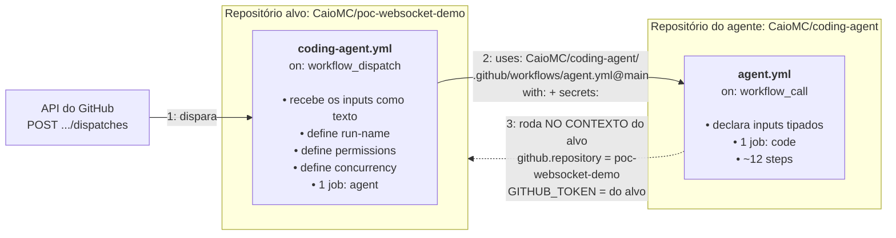

### 6.1 A analogia

Pense no `coding-agent.yml` como um **controle remoto** e no `agent.yml` como a **TV**.
O controle fica no repositório alvo, é pequeno e só sabe apertar botões com os parâmetros
certos. A TV, com toda a eletrônica, fica no repositório do agente. Vários repositórios podem
ter o seu próprio controle apontando para a mesma TV.

### 6.2 O que o workflow "de fora" (`coding-agent.yml`) faz

```yaml
on:
  workflow_dispatch:            # (1) pode ser disparado pela API ou pelo botão
    inputs: { issue_number, request_id, base_branch, work_branch }   # resumido

run-name: coding-agent ${{ inputs.request_id }}   # (2) o nome que o assistente procura

permissions:                    # (3) o teto do que o GITHUB_TOKEN pode fazer
  contents: write               #     push da branch
  pull-requests: write          #     abrir o PR
  issues: write                 #     comentar na issue

concurrency:                    # (4) nunca dois agentes na mesma branch
  group: coding-agent-${{ inputs.work_branch }}

jobs:
  agent:
    uses: CaioMC/coding-agent/.github/workflows/agent.yml@main   # (5) chama o outro workflow
    with:
      issue_number: ${{ fromJSON(inputs.issue_number) }}          # (6) texto "4" → número 4
      request_id:   ${{ inputs.request_id }}
      base_branch:  ${{ inputs.base_branch }}
      work_branch:  ${{ inputs.work_branch }}
      model:  ${{ vars.CODING_AGENT_MODEL  || 'qwen3:4b' }}       # (7) configurável por variável
      runner: ${{ vars.CODING_AGENT_RUNNER || 'ubuntu-latest' }}
    secrets:
      OLLAMA_BASE_URL: ${{ secrets.OLLAMA_BASE_URL }}             # (8) secrets não passam sozinhos
```

| Nº | Por que isso existe |
|---|---|
| (1) | Sem `workflow_dispatch` o workflow não pode ser disparado pela API |
| (2) | O dispatch não devolve o id do run. O nome `coding-agent 28e86892` é a "etiqueta" que o assistente procura depois |
| (3) | Num workflow chamado, as permissões do `GITHUB_TOKEN` **nunca passam** das do workflow que chama. Se faltar alguma aqui, o push ou o PR falham lá dentro |
| (4) | Se o mesmo pedido for disparado duas vezes, o segundo run espera o primeiro terminar |
| (5) | `@main` significa "use a versão da branch `main` do repositório do agente". Dá para fixar uma tag, por exemplo `@v1` |
| (6) | **A armadilha.** O dispatch entrega `"4"` (texto), mas o `agent.yml` declara `issue_number` como `type: number`. Sem `fromJSON`, o GitHub rejeita o run **antes de criar qualquer job**, com `Unexpected value '4'` |
| (7) | Troque o modelo ou a máquina sem editar YAML: *Settings → Secrets and variables → Actions → Variables* |
| (8) | Workflows reutilizáveis **não herdam** secrets. É preciso repassar cada um (ou usar `secrets: inherit`) |

### 6.3 "No contexto do alvo": o detalhe mais importante

Mesmo com o código YAML no repositório `coding-agent`, o job **roda como se fosse do
repositório alvo**:

| Expressão dentro do `agent.yml` | Vale |
|---|---|
| `github.repository` | `CaioMC/poc-websocket-demo` (o alvo, não o agente) |
| `github.token` | `GITHUB_TOKEN` do **alvo**, com as permissões do passo (3) |
| `secrets.OLLAMA_BASE_URL` | O secret do **alvo**, repassado no passo (8) |
| `actions/checkout` sem `repository:` | Baixa o **alvo** |

É por isso que o agente consegue fazer push e abrir PR no seu repositório **sem nenhum
token pessoal**.

---

## 7. Etapa 5: dentro do job, passo a passo

O job `code` do `agent.yml` roda numa VM `ubuntu-latest`. Cada passo produz algo que o
próximo usa:

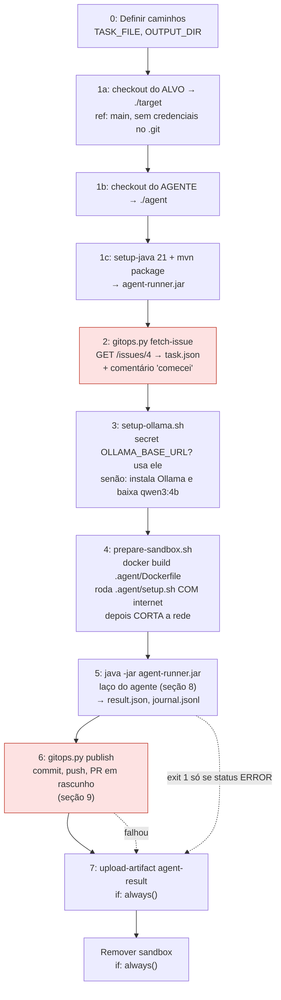

> Os passos em vermelho (2 e 6) são os **únicos que recebem o `GITHUB_TOKEN`**. O passo 5,
> onde o modelo trabalha, não recebe token nenhum.

| Passo | Script | Entrada | Saída | Pode falhar se... |
|---|---|---|---|---|
| 1a | `actions/checkout` | `inputs.base_branch` | código do alvo em `./target` | a branch base não existe |
| 1b-c | `actions/checkout` + Maven | `CaioMC/coding-agent@main` | `agent-runner.jar` | o repositório do agente não for acessível |
| 2 | `scripts/gitops.py fetch-issue` | `ISSUE_NUMBER` | `task.json` com título, descrição e **critérios de aceite** (linhas `- [ ]`) | falta `issues: write` |
| 3 | `scripts/setup-ollama.sh` | `secrets.OLLAMA_BASE_URL`, `inputs.model` | variável `OLLAMA_BASE_URL` para os próximos passos | o download do modelo falhar |
| 4 | `scripts/prepare-sandbox.sh` | `.agent/Dockerfile`, `.agent/setup.sh` | container `agent-sandbox-<run_id>` **sem rede**, com as dependências em cache | o build do Dockerfile ou o `setup.sh` falharem |
| 5 | `agent-runner.jar` | `task.json`, container, Ollama | `result.json`, `journal.jsonl` | o Ollama estiver fora do ar (status `ERROR`, exit 1) |
| 6 | `scripts/gitops.py publish` | alterações no `./target`, `result.json` | branch, PR, `changes.patch`, comentário na issue | falta "Allow GitHub Actions to create and approve pull requests" |
| 7 | `actions/upload-artifact` | `OUTPUT_DIR` | artefato `agent-result` | nunca bloqueia (`if: always()`) |

### 7.1 Por que cortar a rede do container?

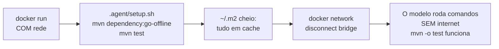

O código que o modelo escreve e os comandos que ele roda **não conseguem acessar a
internet**: não baixam nada estranho e não vazam nada. Por isso o `AGENTS.md` manda sempre
usar `mvn -o` e proíbe novas dependências no `pom.xml`.

---

## 8. Etapa 6: o laço do agente (pensar, agir, observar)

O `agent-runner` (classe `CodingAgent`) usa o Spring AI com **execução de ferramentas
controlada por nós** (`internalToolExecutionEnabled = false`). Assim é o código que conta as
voltas, impõe limites e decide quando parar.

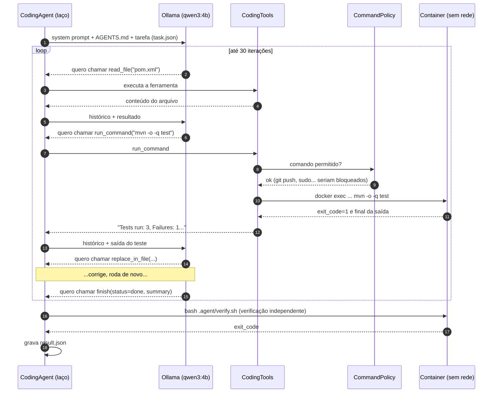

**Ferramentas oferecidas ao modelo:** `list_files`, `read_file`, `search_code`,
`replace_in_file`, `write_file`, `run_command` e `finish`.

**Os limites (e o que acontece quando são atingidos):**

| Situação | Status final no `result.json` |
|---|---|
| Chamou `finish(done)` e o `verify.sh` passou (ou não existe) | `COMPLETED` |
| Chamou `finish(done)` mas o `verify.sh` falhou | `VERIFICATION_FAILED` |
| Chamou `finish` com outro status, ou respondeu só com texto 3 vezes (sem usar ferramentas) | `INCOMPLETE` |
| Passou de 30 iterações (`AGENT_MAX_ITERATIONS`) | `BUDGET_EXCEEDED` |
| Exceção (ex.: Ollama fora do ar) | `ERROR` → o processo sai com código 1 |

> 💡 **A verificação é independente do modelo.** Mesmo que o modelo diga "tudo passou", o
> `.agent/verify.sh` roda depois do laço, e **esse** resultado é o que vai para o PR e para o chat.

---

## 9. Etapa 7: o resultado e a publicação do PR

O passo `gitops.py publish` decide o que fazer com o trabalho do agente:

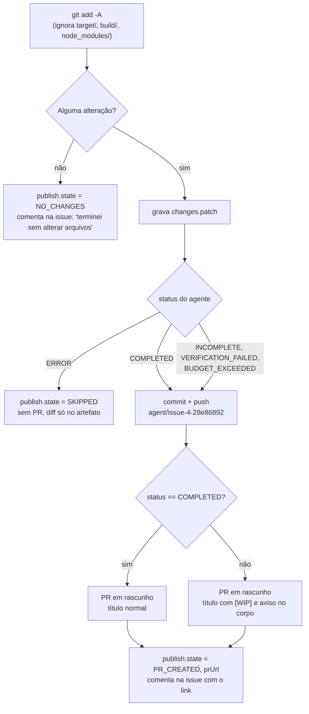

O PR sempre:
- é **rascunho** (`draft: true`), ou seja, nunca entra sem revisão humana;
- tem `Closes #4` no corpo, então a issue fecha sozinha quando o PR for mergeado;
- traz o resumo do agente, o resultado da verificação e os últimos comandos executados.

### 9.1 O conteúdo do artefato `agent-result`

| Arquivo | Para quê |
|---|---|
| `result.json` | **O que o assistente lê.** Status, resumo, arquivos alterados, verificação e `publish.prUrl` |
| `changes.patch` | O diff completo, útil quando não houve PR |
| `journal.jsonl` | Cada passo do laço (o que o modelo disse, cada ferramenta e saída). Serve para depurar o agente |

Exemplo resumido de `result.json`:

```json
{
  "requestId": "28e86892",
  "issueNumber": 4,
  "status": "COMPLETED",
  "summary": "Criei HealthController em adapters/health/web e o teste HealthControllerTest.",
  "iterations": 9,
  "verification": { "command": "bash .agent/verify.sh", "executed": true, "exitCode": 0 },
  "changedFiles": ["src/main/java/.../HealthController.java", "src/test/java/.../HealthControllerTest.java"],
  "publish": { "state": "PR_CREATED", "prUrl": "https://github.com/CaioMC/poc-websocket-demo/pull/5" }
}
```

---

## 10. Etapa 8: o assistente acompanha a execução

Enquanto tudo isso roda no GitHub, o assistente **pergunta de tempos em tempos** como está.
Quem pergunta é o **servidor**, não o navegador.

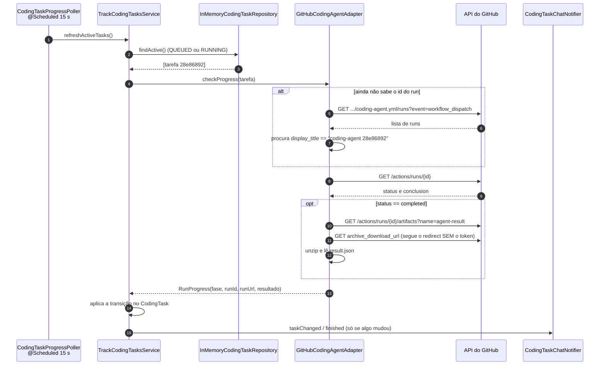

### 10.1 Como o status do GitHub vira status da tarefa

| O que o GitHub diz | `RunProgress.Phase` | O que acontece com a `CodingTask` |
|---|---|---|
| Nenhum run com o nome `coding-agent 28e86892` | `NOT_FOUND` | Continua `QUEUED`. Depois de **10 min** (`dispatch-timeout`) vira `FAILED`: "a execução do workflow não apareceu" |
| `status: queued` / `waiting` | `QUEUED` | Continua `QUEUED` (o link do run já aparece no cartão) |
| `status: in_progress` | `RUNNING` | Vira `RUNNING` |
| `status: completed`, `conclusion: success` | `SUCCEEDED` | Vira `COMPLETED` com o `result.json` |
| `status: completed`, qualquer outra `conclusion` | `FAILED` | Vira `FAILED`: "o workflow terminou com falha" (com o `result.json`, se o artefato existir) |

### 10.2 O ciclo de vida completo

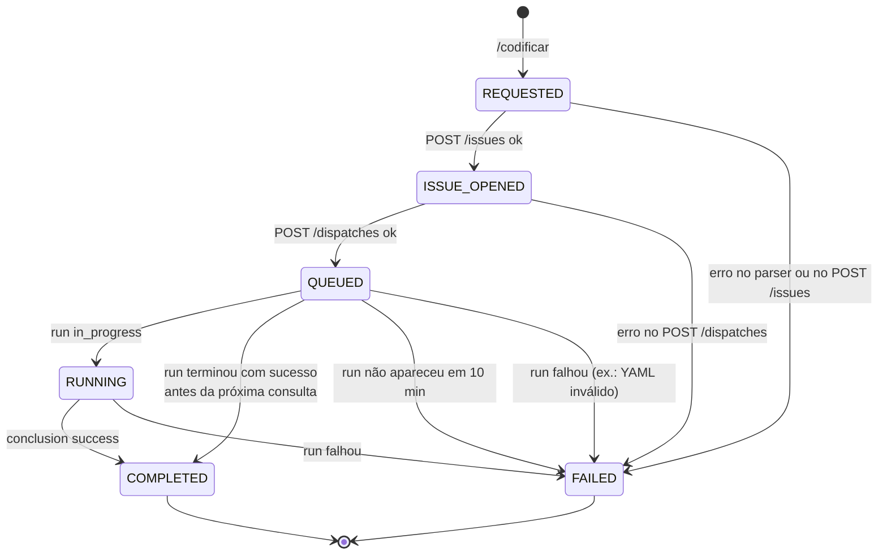

> ⚠️ **`COMPLETED` não quer dizer "o agente acertou".** Quer dizer que o **workflow** terminou
> sem erro. O agente pode ter terminado `INCOMPLETE` e aberto um PR `[WIP]`. O status do
> agente aparece separado, no cartão e na mensagem ("Status do agente: ...").

> 💡 **Falhas de rede na consulta não encerram a tarefa.** Se a chamada ao GitHub falhar, o
> `TrackCodingTasksService` registra um aviso no log e tenta de novo 15 s depois.

---

## 11. Etapa 9: a resposta volta para o chat

Toda mudança chega ao navegador por **dois canais** do mesmo WebSocket:

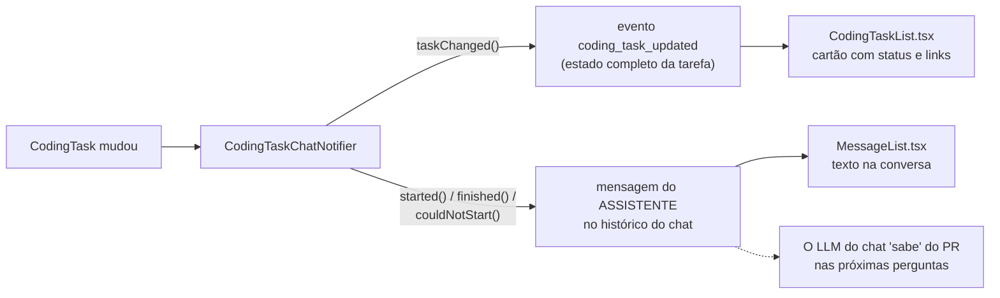

| Momento | Mensagem no chat | Evento `coding_task_updated` |
|---|---|---|
| Pedido recebido | `/codificar ...` (como sua mensagem) | |
| Issue criada | | `ISSUE_OPENED` |
| Workflow disparado | "Abri a issue 4 ... Branch de trabalho: ..." | `QUEUED` |
| Run encontrado | | `QUEUED` + `runUrl` |
| Run rodando | | `RUNNING` |
| Terminou | "O agente terminou a issue 4. PR em rascunho: ..." com status, verificação, arquivos e resumo | `COMPLETED` ou `FAILED` + resultado |
| Erro ao iniciar | "Não consegui iniciar a codificação: GitHub respondeu HTTP ..." | `FAILED` |

**E se eu fechar a aba?** Ao reconectar, o `ChatWebSocketHandler` manda primeiro o `replay`
(o histórico, com todas as mensagens acima) e depois um `coding_task_updated` para cada tarefa
da conversa (`sendCodingTasksTo`). Nada se perde, enquanto o servidor estiver de pé: as
tarefas ficam **em memória**.

---

## 12. Quem tem qual credencial

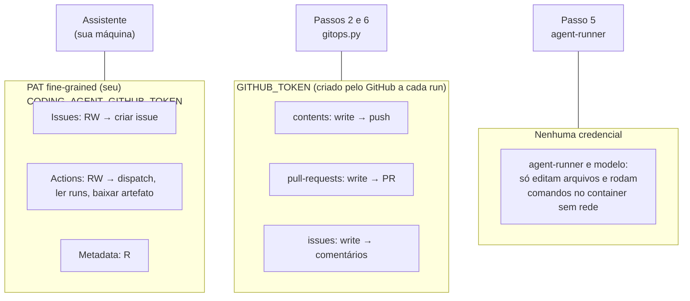

| Regra | Por quê |
|---|---|
| O PAT fica **só** no servidor do assistente, por **variável de ambiente** | Se ele for parar no `application.yaml` ou numa *Variable* do Actions, qualquer pessoa com acesso ao repositório lê |
| O workflow **não** usa o PAT | O `GITHUB_TOKEN` basta, vale só para aquele repositório e expira no fim do job |
| O checkout usa `persist-credentials: false` | O token não fica gravado no `.git/config` que o agente enxerga |
| O `CommandPolicy` bloqueia `git push`, `git commit`, `sudo`... | Não é a barreira principal (essa é "sem rede e sem token"), mas dá ao modelo uma resposta clara |

---

## 13. Onde cada erro acontece (e como resolver)

Os erros abaixo aparecem em ordem: cada um só surge depois que o anterior foi resolvido.

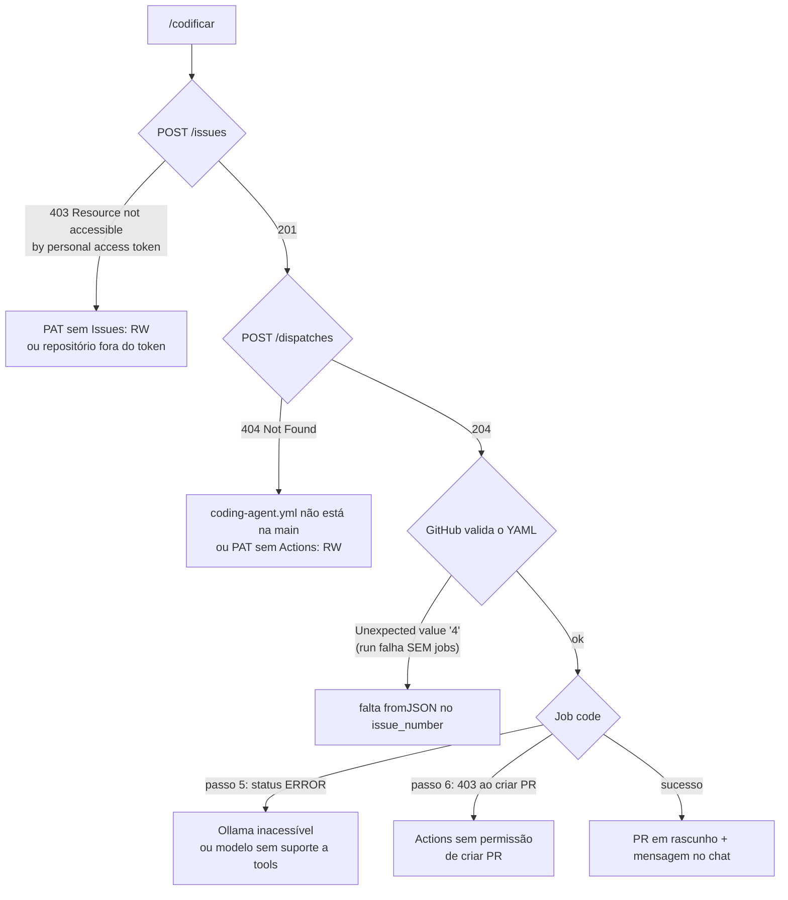

| Sintoma | Onde aparece | Causa | Como resolver |
|---|---|---|---|
| `HTTP 403 ... Resource not accessible by personal access token` em `POST /issues` | Log do assistente e chat | O PAT fine-grained não tem **Issues: Read and write** ou não inclui o repositório | Edite o token: *Repository access* com o repositório e *Issues: Read and write* |
| `token do GitHub não configurado` | Chat | Falta a variável `CODING_AGENT_GITHUB_TOKEN` | `export CODING_AGENT_GITHUB_TOKEN=...` e reinicie |
| `HTTP 404` em `POST .../dispatches` | Log do assistente e chat | O `coding-agent.yml` **não está na branch `main`** (o GitHub só registra workflows que existem na branch padrão), ou o PAT não tem **Actions: RW** (o GitHub responde 404 em vez de 403) | Faça merge do workflow na `main` e confira as permissões do token |
| Run falha em segundos, **sem nenhum job**, com `Unexpected value '4'` | Página do run no Actions. No chat: "o workflow terminou com falha" | Os inputs do dispatch são texto, e o `agent.yml` espera número | `issue_number: ${{ fromJSON(inputs.issue_number) }}` no `coding-agent.yml` **da `main`** |
| A correção foi feita, mas o erro continua | Página do run | A correção está em outra branch. O run usa o workflow do `ref` (`main`) | Confira `head_sha` do run e faça a correção chegar à `main` |
| "a execução do workflow não apareceu" após 10 min | Chat | Workflow desativado, nome do arquivo diferente ou `run-name` alterado | Ative em *Actions*, confira `app.coding-agent.workflow-file` e mantenha `run-name: coding-agent ${{ inputs.request_id }}` |
| Passo "Commit, push e PR" falha com `HTTP 403` em `POST /pulls` | Log do run | *Allow GitHub Actions to create and approve pull requests* desligado | *Settings → Actions → General → Workflow permissions* |
| Status do agente `ERROR` | Chat e `result.json` | Ollama inacessível (secret `OLLAMA_BASE_URL` errado) ou modelo sem suporte a tools | Confira o secret ou remova-o para usar o Ollama no runner |
| `INCOMPLETE` / `BUDGET_EXCEEDED` | Chat e PR `[WIP]` | Modelo pequeno para a tarefa | Modelo maior (`CODING_AGENT_MODEL`), tarefa menor, `AGENTS.md` mais claro |

> 🔎 **Dica para depurar um run que falhou sem jobs:** a CLI `gh run view <id> --log-failed`
> não mostra nada, porque não há log. O erro aparece só **na página do run**, na seção
> *Annotations*. Veja também o `head_sha`: `gh api repos/<repo>/actions/runs/<id> --jq .head_sha`
> mostra **qual versão** do workflow rodou.

---

## 14. Mapa de arquivos

### Neste repositório (`poc-websocket-demo`)

| Etapa | Arquivo | Papel |
|---|---|---|
| 1 | `frontend/src/utils/codingCommand.ts` | Reconhece `/codificar` |
| 1 | `frontend/src/components/Composer.tsx` | Decide entre chat e agente |
| 1 | `frontend/src/hooks/useChat.ts` | Envia `coding_task` e trata `coding_task_updated` |
| 1 | `adapters/chat/websocket/ChatWebSocketHandler.java` | Recebe `coding_task` e manda o estado das tarefas ao reconectar |
| 2 | `core/codingtask/application/StartCodingTaskService.java` | Orquestra: contexto, issue, dispatch |
| 2 | `core/codingtask/application/CodingTaskRequestParser.java` | `repo=`, título, descrição |
| 2 | `core/codingtask/application/IssueBodyBuilder.java` | Corpo da issue |
| 2 a 8 | `core/codingtask/domain/CodingTask.java` | Estado e transições |
| 2 a 8 | `core/codingtask/domain/agent/CodingAgentPort.java` | Porta: abrir, disparar, acompanhar |
| 2, 3, 8 | `adapters/codingtask/github/GitHubCodingAgentAdapter.java` | Implementação com a REST API do GitHub |
| 8 | `adapters/codingtask/scheduling/CodingTaskProgressPoller.java` | Relógio de 15 s |
| 8 | `core/codingtask/application/TrackCodingTasksService.java` | Traduz o status do run em transições |
| 9 | `core/codingtask/application/CodingTaskChatNotifier.java` | Mensagens no chat e eventos do cartão |
| 9 | `adapters/chat/websocket/event/ChatWebSocketEventBroadcaster.java` | Envia `coding_task_updated` |
| 9 | `frontend/src/components/CodingTaskList.tsx` | O cartão da tarefa |
| 4 | `.github/workflows/coding-agent.yml` | O "controle remoto" |
| 5 | `.agent/Dockerfile`, `.agent/setup.sh`, `.agent/verify.sh` | Ambiente do sandbox e verificação final |
| 6 | `AGENTS.md` | Instruções que o modelo lê antes de começar |
| – | `src/main/resources/application.yaml` (`app.coding-agent.*`) | Repositório, branch, intervalo, timeout e token (via variável) |

### No repositório do agente ([`CaioMC/coding-agent`](https://github.com/CaioMC/coding-agent))

| Etapa | Arquivo | Papel |
|---|---|---|
| 4, 5 | `.github/workflows/agent.yml` | O workflow reutilizável: o job `code` e seus passos |
| 5, 7 | `scripts/gitops.py` | `fetch-issue` e `publish` (os únicos com token) |
| 5 | `scripts/setup-ollama.sh` | Ollama externo ou local |
| 5 | `scripts/prepare-sandbox.sh` | Container, dependências e corte de rede |
| 6 | `agent-runner/.../loop/CodingAgent.java` | O laço pensar, agir, observar |
| 6 | `agent-runner/.../tools/CodingTools.java` | As ferramentas oferecidas ao modelo |
| 6 | `agent-runner/.../core/CommandPolicy.java` | Comandos bloqueados |
| – | `templates/target-repo/` | Os arquivos para copiar ao instalar o agente em outro repositório |
