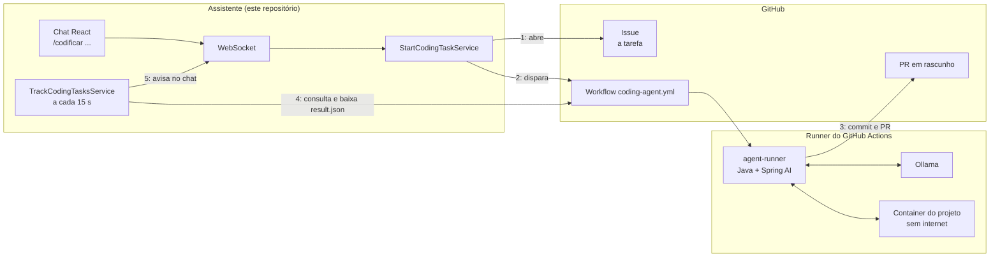
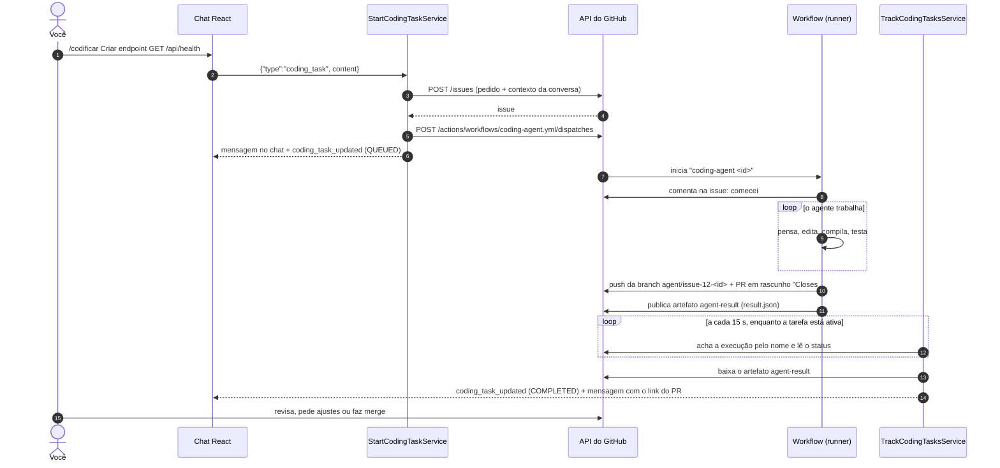
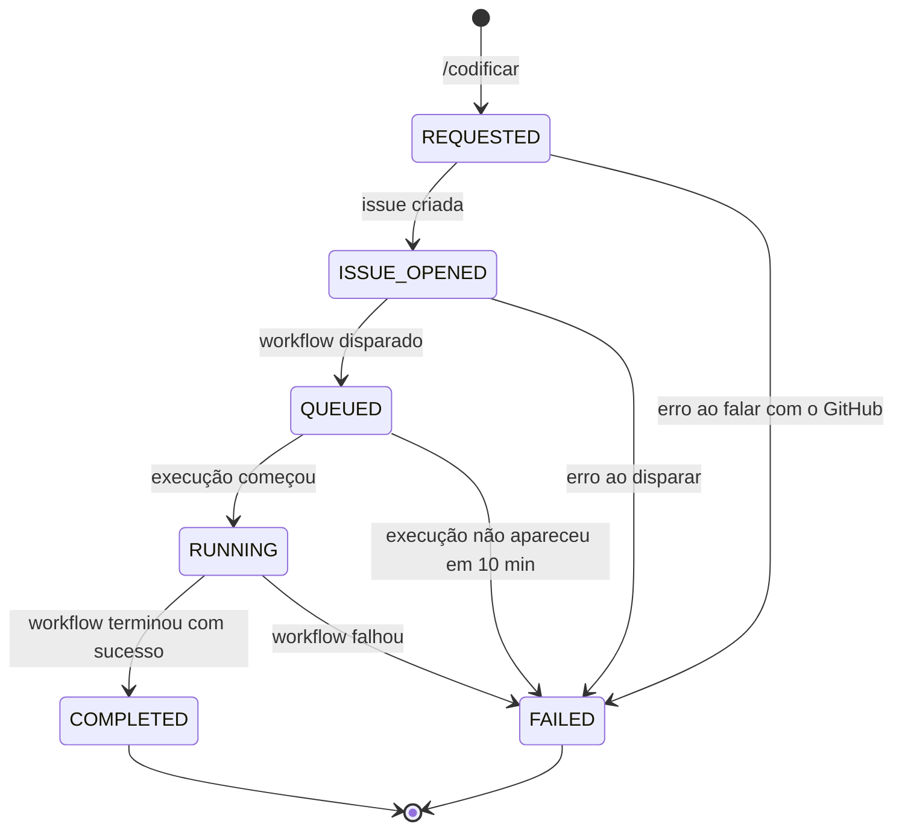

# Agente de codificação: do chat ao pull request

Este guia explica como o chat deste projeto virou o **gatilho** de um agente de codificação
que roda no GitHub Actions. Você escreve `/codificar <o que implementar>` no chat; o
assistente abre uma issue com o seu pedido e o contexto da conversa, dispara um workflow, e
o agente devolve um **pull request em rascunho** para você revisar. Tudo acontece dentro do
ecossistema do GitHub: issue, Actions, branch e PR.

O código do agente fica em outro repositório, o
[`coding-agent`](https://github.com/CaioMC/coding-agent). Este documento cobre o lado do
assistente e como as duas partes se encaixam.

> 📖 **Quer ver cada chamada?** O [`coding-agent-flow.md`](coding-agent-flow.md) acompanha uma
> tarefa do começo ao fim, com um diagrama por etapa: a criação da issue, o disparo, o
> workflow que chama o workflow reutilizável, o laço do agente, a publicação do PR, o
> acompanhamento e um mapa de onde cada erro acontece.

## Índice

1. [A ideia em uma frase](#1-a-ideia-em-uma-frase)
2. [Visão geral](#2-visão-geral)
3. [Uma tarefa, passo a passo](#3-uma-tarefa-passo-a-passo)
4. [O ciclo de vida da tarefa](#4-o-ciclo-de-vida-da-tarefa)
5. [Onde está cada peça](#5-onde-está-cada-peça)
6. [Como o modelo observa a execução](#6-como-o-modelo-observa-a-execução)
7. [Segurança: quem pode o quê](#7-segurança-quem-pode-o-quê)
8. [Configuração passo a passo](#8-configuração-passo-a-passo)
9. [Três formas de rodar o modelo](#9-três-formas-de-rodar-o-modelo)
10. [Limitações e próximos passos](#10-limitações-e-próximos-passos)
11. [Solução de problemas](#11-solução-de-problemas)

## 1. A ideia em uma frase

**O assistente não escreve código: ele transforma a conversa em uma tarefa bem descrita e
entrega essa tarefa para um agente que trabalha num computador descartável do GitHub.**

Uma analogia: o assistente é o analista que conversa com você e escreve o chamado; a issue
é o chamado; o GitHub Actions é a estação de trabalho emprestada; o agente é o desenvolvedor
que pega o chamado, programa, roda os testes e abre o PR; e você é o revisor que decide se
aquilo entra ou não.

## 2. Visão geral



São três lugares diferentes, e cada um faz uma coisa só:

| Onde | O que faz | O que NÃO faz |
|---|---|---|
| Assistente | Entende o pedido, junta o contexto da conversa, abre a issue, dispara e acompanha | Não executa código, não tem permissão de push |
| GitHub | Guarda a tarefa (issue), roda o workflow, guarda o resultado (PR e artefato) | Não decide nada sozinho |
| Runner | Roda o agente: lê, edita, compila e testa num container isolado | Não fala com o assistente; só publica o resultado |

## 3. Uma tarefa, passo a passo



Três detalhes que fazem isso funcionar:

- **Como o assistente acha a execução.** A API que dispara o workflow não devolve o id da
  execução. Por isso o assistente gera um id curto (ex.: `b95e5b38`) e o workflow usa
  `run-name: coding-agent b95e5b38`. Depois é só procurar a execução com esse nome.
- **Como o resultado volta.** O workflow publica um artefato `agent-result` com o
  `result.json`: status do agente, resumo, arquivos alterados, resultado dos testes e o link
  do PR. O assistente baixa esse zip e transforma em mensagem no chat.
- **Quem consulta o GitHub é o servidor, não o navegador.** O `CodingTaskProgressPoller`
  roda a cada 15 segundos, e só quando há tarefa ativa. O navegador continua recebendo
  eventos pelo WebSocket, como no resto da POC. Se você fechar a aba e voltar, a reconexão
  traz o histórico (com as mensagens do agente) e o estado atual das tarefas.

## 4. O ciclo de vida da tarefa



As transições vivem no próprio `CodingTask` (o aggregate), e não espalhadas pelos serviços.
`COMPLETED` quer dizer que o workflow terminou bem; o status do **agente** (se os testes
passaram, se ele concluiu) vem no `result.json` e aparece no cartão e na mensagem final.

## 5. Onde está cada peça

Neste repositório, o gatilho é um contexto novo, `codingtask`, montado no mesmo padrão
Ports & Adapters do chat:

| Camada | Classe | Papel |
|---|---|---|
| domain | `CodingTask`, `CodingTaskStatus`, `CodingTaskResult` | O estado da tarefa e suas transições |
| domain (porta) | `CodingAgentPort` | Abrir tarefa, disparar, acompanhar. Não sabe que é GitHub |
| usecase | `StartCodingTaskUseCase`, `TrackCodingTasksUseCase`, `ListCodingTasksUseCase` | Um caso de uso por interface |
| application | `StartCodingTaskService` | O gatilho: issue com contexto + dispatch |
| application | `TrackCodingTasksService` | Acompanha e avisa quando algo muda |
| application | `CodingTaskChatNotifier` | Transforma marcos da tarefa em mensagens do chat |
| adapter | `GitHubCodingAgentAdapter` | Implementa a porta com a REST API do GitHub (só JDK + Jackson) |
| adapter | `CodingTaskProgressPoller` | `@Scheduled` que chama o acompanhamento |
| adapter | `ChatWebSocketEventBroadcaster` | Agora também publica `coding_task_updated` |
| frontend | `utils/codingCommand.ts`, `CodingTaskList.tsx` | Reconhece `/codificar` e mostra os cartões |

No repositório alvo (aqui, este mesmo repositório, para a demonstração):

| Arquivo | Para quê |
|---|---|
| `.github/workflows/coding-agent.yml` | Instala o agente: um arquivo pequeno que chama o workflow reutilizável do `coding-agent` |
| `.agent/Dockerfile` | Imagem onde o agente compila e testa (Java 21 + Maven) |
| `.agent/setup.sh` | Baixa dependências, com internet, antes do agente começar |
| `.agent/verify.sh` | Verificação final, sem internet, depois que o agente termina |
| `AGENTS.md` | Instruções para o agente: comandos, arquitetura, convenções |

## 6. Como o modelo observa a execução

Dentro do runner, o `agent-runner` (Java 21 + Spring AI) oferece ferramentas ao modelo:
`list_files`, `read_file`, `search_code`, `replace_in_file`, `write_file`, `run_command` e
`finish`. O laço é simples:

1. o modelo pede, por exemplo, `run_command("mvn -o -q test")`;
2. o agent-runner executa o comando **dentro do container do projeto** e devolve ao modelo
   o `exit_code` e o final da saída (o erro de compilação, o teste que falhou);
3. o modelo lê essa saída, corrige com `replace_in_file` e roda de novo;
4. quando está satisfeito, chama `finish`.

Depois do laço, o workflow roda o `.agent/verify.sh` por conta própria. É esse resultado,
e não o que o modelo disse, que vai para o PR. Os detalhes estão no README do
[`coding-agent`](https://github.com/CaioMC/coding-agent).

## 7. Segurança: quem pode o quê

| Quem | Credencial | Pode | Não pode |
|---|---|---|---|
| Assistente | Token fine-grained `CODING_AGENT_GITHUB_TOKEN` | Criar issue, disparar e ler o workflow | Fazer push, abrir PR, ler segredos |
| Workflow (passos de Git) | `GITHUB_TOKEN`, criado pelo GitHub para aquela execução | Push de branch, PR, comentar na issue | Nada fora deste repositório; expira no fim do job |
| Passo do agente | Nenhuma | Editar arquivos e rodar comandos no container | Push, API do GitHub, internet (o container fica sem rede) |
| Você | Sua conta | Revisar e fazer merge | |

O `GITHUB_TOKEN` nunca entra no `.git/config` do repositório que o agente enxerga
(`persist-credentials: false`), e só os passos de publicação recebem o token.

## 8. Configuração passo a passo

1. **Publique o agente.** Crie o repositório `CaioMC/coding-agent` no GitHub e envie para lá
   o conteúdo do projeto `coding-agent`. Se usar outro nome, ajuste a linha `uses:` de
   `.github/workflows/coding-agent.yml`.
2. **Libere o GitHub Actions para abrir PRs** neste repositório: *Settings > Actions >
   General > Workflow permissions*, marque **Read and write permissions** e **Allow GitHub
   Actions to create and approve pull requests**.
3. **Crie o token do assistente**: *Settings (da sua conta) > Developer settings >
   Fine-grained tokens*, com acesso só a este repositório e as permissões **Issues: Read and
   write**, **Actions: Read and write** e **Metadata: Read**.
4. **Suba o assistente com o token**:
   ```bash
   export CODING_AGENT_GITHUB_TOKEN=github_pat_...
   export CODING_AGENT_REPOSITORY=CaioMC/poc-websocket-demo   # padrão
   mvn spring-boot:run
   ```
5. **Peça uma tarefa no chat**:
   ```
   /codificar Criar endpoint GET /api/health que responde {"status":"UP"}
   - [ ] responde HTTP 200
   - [ ] tem teste unitário
   ```
   As linhas `- [ ]` viram critérios de aceite para o agente. Para outro repositório, comece
   com `repo=owner/repo`: `/codificar repo=CaioMC/outro Corrigir o login`.
6. **Acompanhe**: o cartão acima do campo de mensagem mostra o status e os links da issue,
   da execução e, no fim, do PR.

Para testar o workflow sem o assistente: crie uma issue à mão e rode *Actions >
coding-agent > Run workflow*, informando o número da issue, um `request_id` qualquer e uma
branch de trabalho.

## 9. Três formas de rodar o modelo

| Opção | Como configurar | Quando usar |
|---|---|---|
| Ollama no próprio runner (padrão) | Nada. O workflow instala o Ollama e baixa o modelo (`qwen3:4b`) | Demonstração sem infraestrutura. Roda em CPU: lento e com modelo pequeno |
| Ollama externo | Secret `OLLAMA_BASE_URL` no repositório | Quando há um servidor com GPU acessível pela internet (com autenticação na frente) |
| Runner na sua máquina | Registre um *self-hosted runner* e defina a variável `CODING_AGENT_RUNNER=self-hosted`; secret `OLLAMA_BASE_URL=http://localhost:11434` | Usar o Ollama e a GPU locais. É a ideia de "rodar na máquina do usuário", só que gerenciada pelo GitHub |

Troque o modelo pela variável `CODING_AGENT_MODEL`. Ele precisa ter suporte a **tools** no
Ollama (ex.: família `qwen3`, `llama3.1`). O modelo do chat (`qwen2.5:0.5b`) não serve para o
agente: é pequeno demais para seguir um laço de ferramentas.

## 10. Limitações e próximos passos

- **O PR aberto pelo `GITHUB_TOKEN` não dispara outros workflows** (regra do GitHub para
  evitar loops). Se você tiver CI rodando em PRs, ele não vai rodar no PR do agente. A saída
  é usar o token de um GitHub App no passo de publicação.
- **Tarefas em memória.** Reiniciar o servidor esquece as tarefas (issue, execução e PR
  continuam no GitHub).
- **Consulta a cada 15 segundos.** Um próximo passo é receber um webhook do GitHub
  (`workflow_run`) e eliminar a consulta.
- **O gatilho é um comando, não uma decisão do modelo.** Com um modelo de chat maior, dá para
  expor o `StartCodingTaskUseCase` como uma ferramenta (`@Tool` do Spring AI) e deixar o
  próprio assistente decidir quando pedir código.
- **Ajustes pelo PR.** Reexecutar o agente sobre a mesma branch a partir de um comentário no PR.

## 11. Solução de problemas

| Sintoma | Causa provável | O que fazer |
|---|---|---|
| "token do GitHub não configurado" no chat | Falta `CODING_AGENT_GITHUB_TOKEN` | Exporte a variável e reinicie o assistente |
| HTTP 403 "Resource not accessible by personal access token" ao criar a issue | Token sem **Issues: Read and write** ou sem acesso ao repositório | Edite o token (passo 3) |
| HTTP 404 ao disparar | Workflow não existe na `main` (o GitHub só registra workflows da branch padrão), ou o token não tem **Actions: Read and write** | Faça merge do `coding-agent.yml` na `main` e confira o token |
| Run falha em segundos, sem jobs, com `Unexpected value '4'` | Os inputs do dispatch chegam como texto e o workflow reutilizável espera número | Use `fromJSON(inputs.issue_number)` no `coding-agent.yml` da `main` |
| Tarefa falha com "a execução não apareceu" | Workflow desativado ou nome do arquivo diferente | Ative o workflow em *Actions* e confira `app.coding-agent.workflow-file` |
| Workflow falha ao criar o PR | Actions sem permissão de abrir PR | Passo 2 da configuração |
| Agente termina `INCOMPLETE` ou `BUDGET_EXCEEDED` | Modelo pequeno ou tarefa grande | Use um modelo maior, quebre a tarefa, melhore o `AGENTS.md` |

O passo a passo de cada erro, com o diagrama de onde ele acontece, está na
[seção 13 do `coding-agent-flow.md`](coding-agent-flow.md#13-onde-cada-erro-acontece-e-como-resolver).
