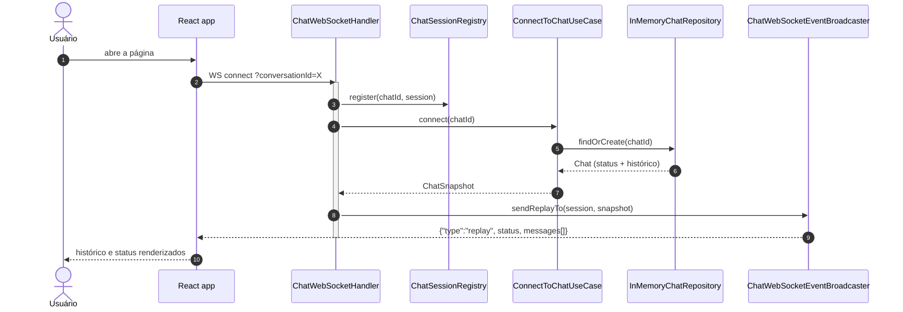
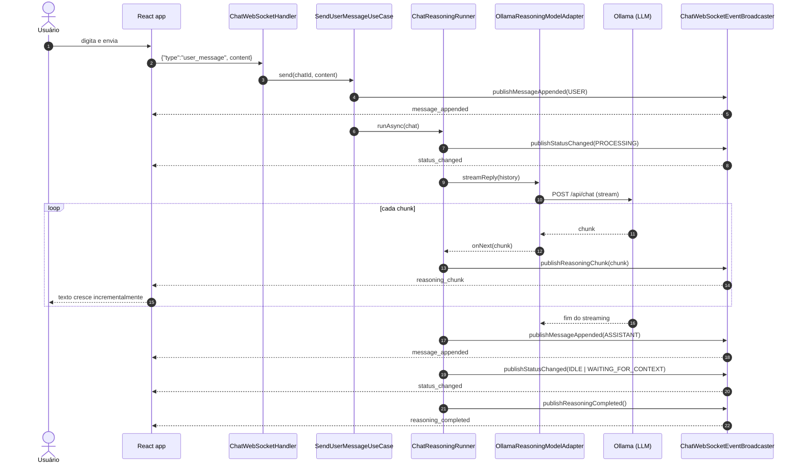
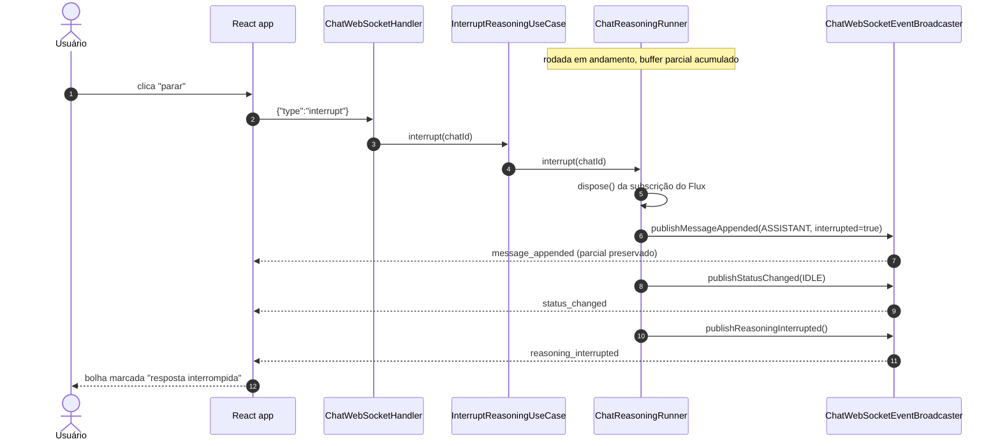
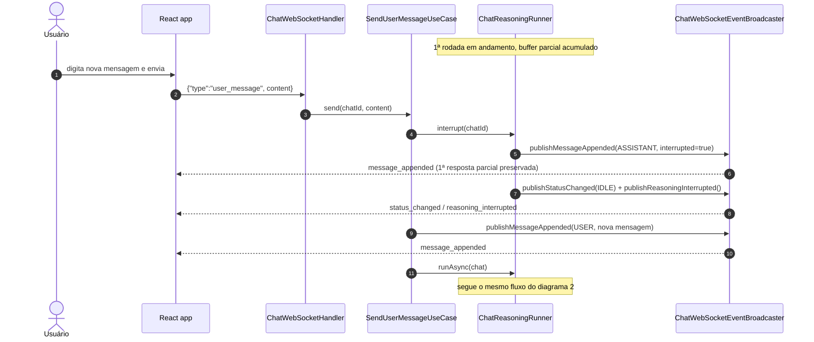
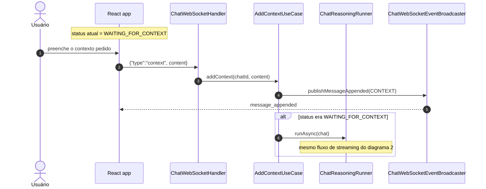
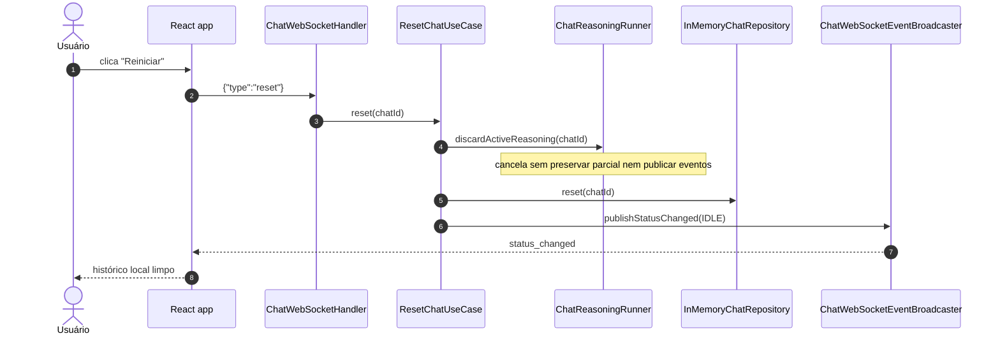

# Diagramas de Sequência

Seis fluxos, cada um em seu próprio diagrama — mais fácil de seguir do que
um único diagrama gigante. Todos cobertos por `ChatWebSocketHandlerIT`
(exceto o de reconexão de rede no cliente, coberto pelo backoff de
`useChatSocket.ts`).

## Índice

1. [Conectar / reconectar (replay)](#1-conectar--reconectar-replay)
2. [Enviar mensagem → streaming completo](#2-enviar-mensagem--streaming-completo)
3. [Parar a geração (stop)](#3-parar-a-geração-stop)
4. [Nova mensagem durante o processamento](#4-nova-mensagem-durante-o-processamento)
5. [Contexto adicional (retomada)](#5-contexto-adicional-retomada)
6. [Reset](#6-reset)

Componentes: **FE** (React), **H** `ChatWebSocketHandler`, **REG**
`ChatSessionRegistry`, os *use cases* (**CONNECT**, **SEND**, **CTX**,
**INTERRUPT**, **RESET**), **RUN** `ChatReasoningRunner`, **AI**
`OllamaReasoningModelAdapter`, **BC** `ChatWebSocketEventBroadcaster`,
**REPO** `InMemoryChatRepository`.

---

## 1. Conectar / reconectar (replay)

Sem polling: o servidor manda o histórico + status assim que a conexão abre
— inclusive o que foi processado enquanto o cliente estava offline.

## 2. Enviar mensagem → streaming completo

## 3. Parar a geração (stop)

Botão "parar" do composer — clicado enquanto o assistente ainda responde.

## 4. Nova mensagem durante o processamento

Sem clicar em "parar" antes — mandar outra mensagem já interrompe a rodada
atual e substitui pela nova, como no ChatGPT/Claude.

## 5. Contexto adicional (retomada)

Quando o modelo pede mais informação (`WAITING_FOR_CONTEXT`), o usuário
responde pela mesma conexão e o raciocínio retoma automaticamente.

## 6. Reset

## Observações

- O streaming continua em background mesmo se o cliente desconectar — o
  `Flux` não depende de nenhuma `WebSocketSession` (ver
  [`websocket-explained.md`](websocket-explained.md#6-estado-no-servidor-não-na-conexão)).
- `ChatReasoningRunner` é o único ponto que sabe interromper uma rodada —
  reutilizado por `InterruptReasoningService` (diagrama 3) e
  `SendUserMessageService` (diagrama 4); "substituir" não é um caso
  especial, é `interrupt()` seguido de `runAsync()`.
- `ChatWebSocketEventBroadcaster` é o único ponto que serializa para JSON e
  escreve nas sessões WebSocket ativas — o `core` não depende disso.
